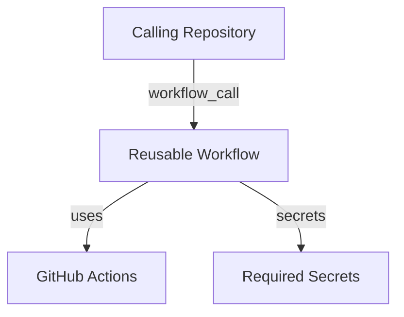

# GitHub Workflows Overview
Keywords: github actions, workflows, reusable workflows, CI/CD

## Repository Structure

This repository contains reusable GitHub Actions workflows and templates for GitHub projects.

```
.github/
├── workflows/
│   ├── claude-generic.yml       # Reusable Claude Code workflow
│   └── mirror-to-bitbucket.yml  # Reusable Bitbucket mirroring workflow
└── pull_request_template.md     # Standard PR template
```

## Workflow Organization

**Reusable Workflows**: Both workflows use `workflow_call` trigger for sharing across repositories.

**Concurrency Control**: Mirror workflow uses repository-scoped concurrency groups to prevent conflicts.

**Permissions Model**: Workflows declare minimal required permissions explicitly (contents, pull-requests, issues, id-token).

## Architecture Pattern



## References
- Workflows: `.github/workflows/*.yml`
- PR Template: `.github/pull_request_template.md`
- Related contexts: workflows/claude, workflows/mirror
